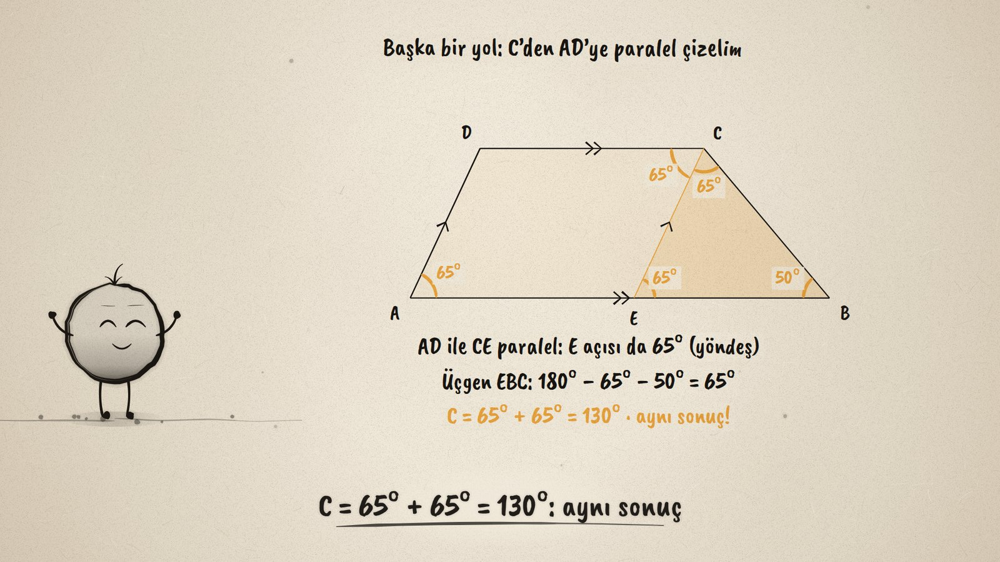
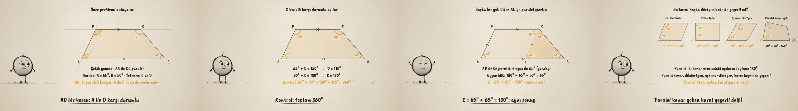

# Açı Dedektifi · Angle Problems in Quadrilaterals

**▶ Tarayıcıda izleyin / Watch in the browser:** https://hakanatas.github.io/aci-dedektifi/ 
**⬇ MP4 + altyazılar / MP4 + subtitles:** [Releases](https://github.com/hakanatas/aci-dedektifi/releases) 
**✎ Kullanılan istem / The prompt behind it:** [PROMPT.md](PROMPT.md) 
**🎞 Bütün filmler / All films:** [Nokta'nın Filmleri](https://hakanatas.github.io/nokta-filmleri/?sinif=6)

> **TR —** 6. sınıf matematik "Geometrik Şekiller" temasındaki MAT.6.3.4 öğrenme çıktısı için hazırlanmış, tamamen JavaScript ile çizilen 92 saniyelik mürekkep animasyonu. Yamuk biçimli bir çiçek tarhının iki köşesi ölçülmüş: A = 65°, B = 50°. Diğer iki köşe kaç derece? Önce bileşenler belirleniyor (şekil yamuk, AB ile DC paralel, verilenler ve istenenler). Sonra şekil başka bir temsile dönüştürülüyor: AB ve DC iki paralel doğru, AD onları kesen bir doğru. Karşı durumlu açılarla D = 115°, C = 130° bulunuyor ve dörtgenin 360°'si ile kontrol ediliyor. İkinci bir yolda C'den AD'ye paralel çizilince yamuk bir paralelkenara ve bir üçgene ayrılıyor; yöndeş açı ve üçgenin 180°'si aynı sonucu veriyor: 65° + 65° = 130°. Son olarak kural genelleniyor ve sınanıyor: paralelkenar, dikdörtgen ve eşkenar dörtgende paralel iki kenar arasındaki açılar 180° ediyor, paralel kenarı olmayan bir dörtgende etmiyor. Altyazılar Türkçe, İngilizce ya da ikisi birlikte seçilebilir.

A 92-second ink animation for **6th-grade maths**, the last film of the third 6th-grade theme. Nokta, the ink character from [The Learning Ink](https://github.com/hakanatas/the-learning-ink), is the guide again. The flower bed is built from its two measured angles (`M` in `src/draw/film.js`), so D, C and E fall exactly where 65° and 50° put them; the angles of the example shapes are measured from the drawings themselves.

## Learning outcome

MEB, Türkiye Yüzyılı Maarif Modeli, Ortaokul Matematik, 6th grade, "Geometrik Şekiller" theme:

**MAT.6.3.4. Üçgen, yamuk, paralelkenar, eşkenar dörtgen, dikdörtgen ve karenin açıları ile ilgili problemleri çözebilme**
- a) Üçgen, yamuk, paralelkenar, eşkenar dörtgen, dikdörtgen ve karenin açıları ile ilgili problemlerde matematiksel bileşenleri (şekil, açı ölçüsü, kenar uzunluğu, paralellik, diklik gibi) belirler.
- b) Matematiksel bileşenler arasındaki ilişkiyi belirler.
- c) Problem bağlamındaki temsilleri farklı temsillere dönüştürür.
- ç) Matematiksel temsillere dönüştürdüğü problemi kendi ifadeleri ile açıklar.
- d) Problemin çözümü için stratejiler geliştirir.
- e) Belirlenen stratejileri çözüm için uygular.
- f) Çözüm yollarını kontrol eder ve çözüme ulaştırmayan stratejiyi değiştirir.
- g) Problemin çözümü için kullandığı veya geliştirdiği stratejileri gözden geçirerek alternatif çözüm yollarını değerlendirir.
- ğ) Kullandığı strateji veya stratejileri farklı problemlerin çözümlerine geneller.
- h) Genellemenin geçerliliğini matematiksel örneklerle değerlendirir.

## Scenes

| # | Time | Scene | What happens | Outcome |
|---|---|---|---|---|
| 1 | 0–10 s | Çiçek tarhı | A trapezoid-shaped bed: A = 65°, B = 50°, C and D unknown. | a |
| 2 | 10–28 s | Problemi anla | The shape, the parallel sides, given and asked; AB and DC become two parallels, AD a transversal. | a, b, c, ç |
| 3 | 28–46 s | Çöz ve kontrol et | Same-side angles: D = 115°, C = 130°; the four add up to 360°. | d, e, f |
| 4 | 46–62 s | Başka bir yol | A parallel to AD through C: a parallelogram and a triangle; 65° + 65° = 130° again. | g |
| 5 | 62–80 s | Genelleme geçerli mi? | The 180° rule on a parallelogram, a rectangle and a rhombus; a shape without parallel sides breaks it. | ğ, h |
| 6 | 80–92 s | Aklında kalsın | Identify, solve, check, and try another way. | d–g |

## Running it

- **Preview:** double-click `index.html` (it works offline).
- **MP4:** run `npm install` once, then `npm run export -- --format=horizontal --captions=tr`.
- **Subtitles and narration:** `npm run srt` writes `out/captions_*.srt` and `narration_notes.txt`.
- **Editing:**
  - Caption text, timings and narration notes: `captions.js`
  - Everything on screen is drawn by `LI.world(t)` in `scenes/scene1.js` (the bed and its angles, the second solution, the example shapes, the words); the other scenes only set the camera.
  - The trapezoid, the example shapes, angle marks and Nokta's poses: `src/draw/film.js`; layout for 16:9 and 9:16: `src/draw/kd.js`

It uses the same engine as The Learning Ink: `renderFrame(t)` as a pure function of time, seeded randomness, and frame-by-frame export.

## Lisans · License

**TR —** Bu film ve kodu [Creative Commons Atıf-GayriTicari 4.0 Uluslararası (CC BY-NC 4.0)](https://creativecommons.org/licenses/by-nc/4.0/deed.tr) lisansıyla paylaşılır. Ticari olmayan her amaçla (derste, okulda, eğitim materyalinde) kopyalayabilir, paylaşabilir ve değiştirebilirsiniz; ancak **kaynak göstermek zorunludur**: eser sahibinin adı ve bu deponun bağlantısı belirtilmeden kullanılamaz. Ticari kullanım (satış, ücretli ürün ya da yayın) için izin alınmalıdır.

**EN —** This film and its code are licensed under [Creative Commons Attribution-NonCommercial 4.0 International (CC BY-NC 4.0)](https://creativecommons.org/licenses/by-nc/4.0/). You may copy, share and adapt them for non-commercial purposes, but **attribution is required**: they may not be used without crediting the author and linking to this repository. Commercial use requires permission.

Atıf örneği / Required credit: *“Açı Dedektifi”, Hakan Ataş, Nokta'nın Filmleri — https://github.com/hakanatas/aci-dedektifi — CC BY-NC 4.0*
